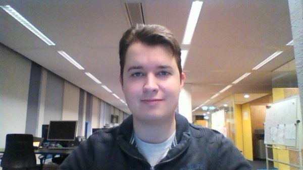

# Kotlin in an evening

---?color=linear-gradient(90deg, white 50%, #e41b40 50%)
@snap[west span-40]
## Danny de Vlam
* 34 jaar oud
* Getrouwd met Desiree  
* 2 Kids
    * Devon
    * Delphie
* 20+ Jaar programeren / bezig met IT
* Momenteel bij Malmberg
@snapend
@snap[east span-40]

@snapend

---
